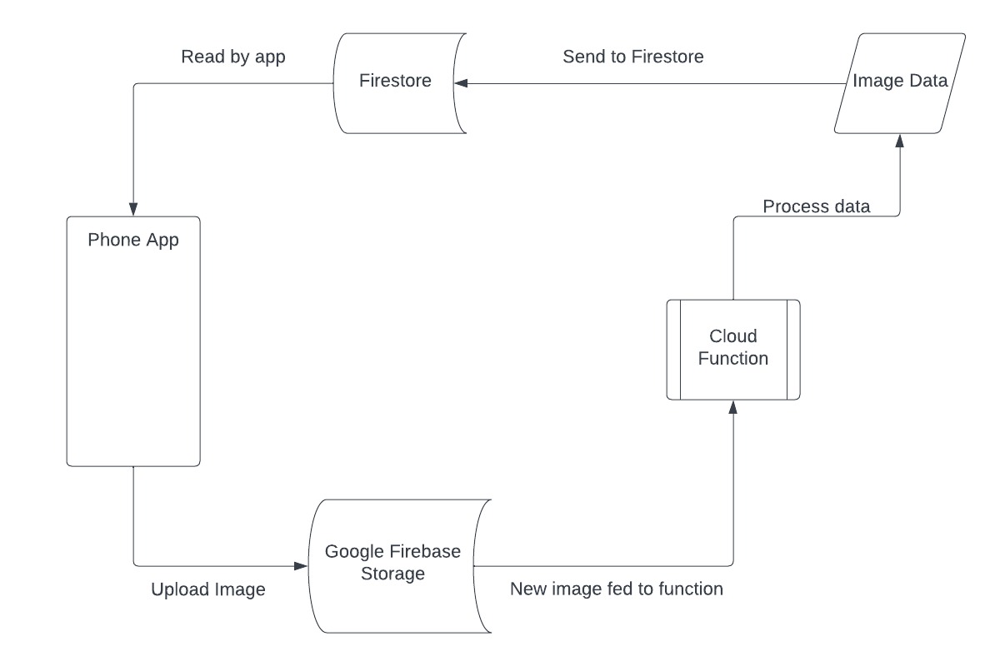

# Firestore Camera

## Description of the project

The purpose of this project is to create a mobile app via the Flutter UI framework that can upload and retrieve data from Google Firebase.

## Video demonstration of the project

[Video of our Project Demo](https://utsacloud-my.sharepoint.com/:v:/g/personal/kyle_hitchcock_my_utsa_edu/Ed_iD08I0ItJtLGo8GbTlEgBQIpMbUtsMY8M1RTzOHaPlA?e=L9KgIZ)

# Architecture of the Application
Our application, in essence, takes an image from your camera or photo gallery and generates a 200x200 thumbnail from it. The application, written in Dart & Flutter and built for Android, implements a simple UI that only serves two functions: to upload an image from a camera or photo gallery, and to display previous images uploaded from the app.

The core function of the app, which generates the thumbnail, utilizes Google Firebase in the cloud. The following diagram shows the general flow of the application, starting from the left:



1. The mobile app uploads a picked image to Firebase Storage
2. A Firebase Cloud Function is triggered to generate a new thumbnail image from a newly uploaded image
3. Along with the new image, the data returned contains a public URL for accessing the image
4. The data is stored in a new document in Google Firestore database
5. The mobile app pulls down the results stored in Firestore documents

## Prerequisites
NOTE: This is based on our configuration in Windows
The application requires the following tools installed on your machine:
- [Dart & Flutter SDK](https://docs.flutter.dev/get-started/install)
- [Android SDK](https://docs.flutter.dev/get-started/install/windows#android-setup)
-- The application requires the Android 10 SDK (API Level 29) via the SDK manager in [Android Studio](https://docs.flutter.dev/get-started/install/windows#install-android-studio)
- [NodeJS](https://nodejs.org/en/)
- [Firebase CLI](https://firebase.google.com/docs/cli)
- [FlutterFire CLI](https://firebase.flutter.dev/docs/cli)

### Installing Flutter tools
Make sure you have the Firebase CLI installed before installing FlutterFire, a Dart based tool to connect the Flutter app to a Firebase project:
```
npm install -g firebase-tools
```

If running Firebase CLI for the first time, be sure to use the `firebase login` command to link your Google account to the tool:
```
firebase
```

Then install FlutterFire CLI:
```
dart pub global activate flutterfire_cli
```
Note: To use Dart packages in the terminal, you may need to set a "Path" environment variable. In Windows, the file location should be in `%localappdata%\Pub\Cache\bin`

## Connecting Firebase to Your App
First, setup your Firebase project in the Google Firebase Console, then pull down this repo: `git clone https://github.com/ColorblindMonk/camera_firestore`

In the root of the application, run the `flutter pub get` to pull in dependencies.

FlutterFire can be initialized from Dart on all platforms using Firebase.initializeApp, however the options for different platforms can vary. The FlutterFire CLI can help, by generating a file (by default called firebase_options.dart) which can be used when calling the initialization method.

The FlutterFire CLI extracts information from your Firebase project and selected project applications to generate all the configuration for a specific platform.

In the root of your application, run the `configure` command:
```
flutterfire configure
```

The configuration command will guide you through a number of processes:
1. Selecting a Firebase project (based on a .firebaserc file or from the Firebase Console).
2. Select 'Android' when the prompt displays what platforms you would like configuration for.
3. Identify which Firebase applications for the chosen platforms should be used to extract configuration for. By default, the CLI will attempt to automatically match Firebase apps based on your current project configuration.
4. The CLI will generate a firebase_options.dart file in your project.
